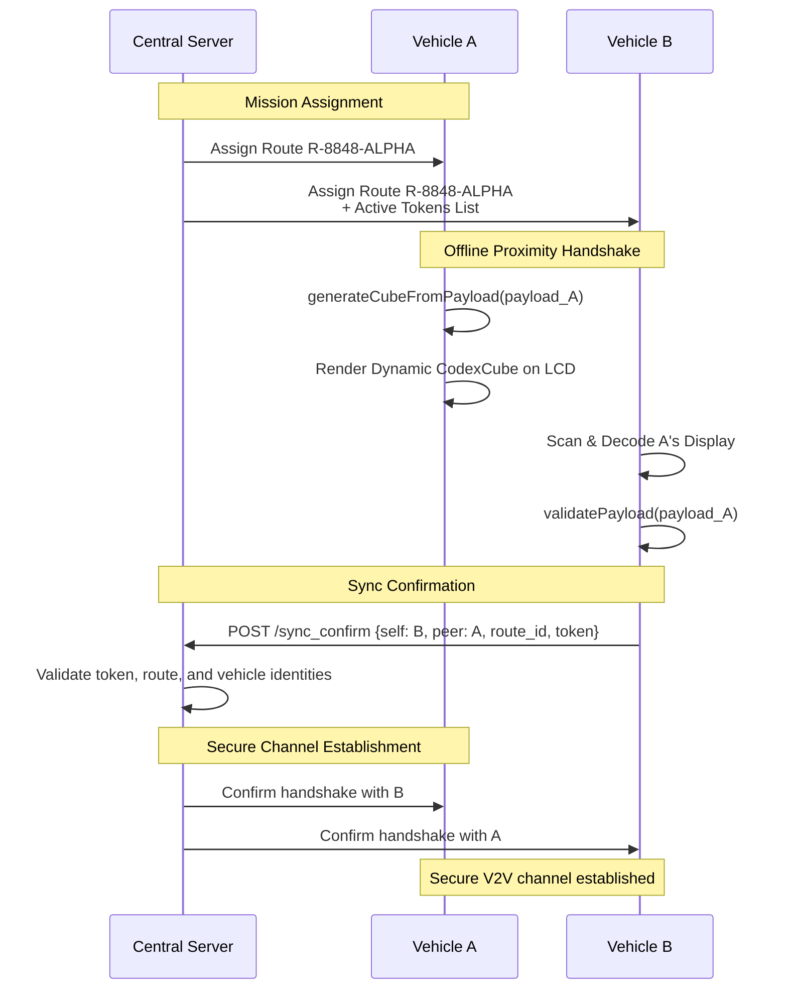

# 🚀 Sirius Codex / Sirius Delivery Cube System (SDCS)


**A New Standard for Dynamic 3D Color Codes "CodexCube 9×9×9" — designed for secure vehicle identification, route protection, and cryptographic proximity verification within the "Black Gepard Delivery OS" logistics system.**

---

## 📖 Table of Contents

- [🌟 Why CodexCube?](#-why-codexcube)
- [🧊 What is a CodexCube?](#-what-is-a-codexcube)
- [🛠️ How It Works](#️-how-it-works)
- [🚚 Use Case: Sirius Delivery Protocol](#-use-case-sirius-delivery-protocol)
- [🏗️ System Architecture](#️-system-architecture)
- [🔧 Tech Stack](#-tech-stack)
- [🚀 Getting Started](#-getting-started)
- [📁 Project Structure](#-project-structure)
- [🛣️ Roadmap](#️-roadmap)

---

## 🌟 Why CodexCube?

Modern logistics and autonomous vehicle systems lack a secure, offline-capable method for **physical proximity verification** and **key exchange** that is resistant to relay attacks and radio interference.

**CodexCube solves this by:**
*   **Visual Cryptography:** Using a dynamic, color-coded 3D matrix as a secure token.
*   **Proximity Proof:** Requiring line-of-sight for code scanning, proving physical presence.
*   **Offline-First Operation:** Enabling secure handshakes without a constant internet connection.
*   **Tamper Resistance:** The code is derived from a cryptographic hash of the mission payload, making it unforgeable.

---

## 🧊 What is a CodexCube?

A CodexCube is a **three-dimensional matrix of 9×9×9 cells** (`cube[z][y][x]`), totaling **729 cells**. Each cell holds a value from `0` to `9`, which is mapped to a specific color.

### Visual Representation

For display on a standard vehicle LCD, the 3D cube is projected into **three 2D perspectives**:

| Projection | Source Slice | Description |
| :--- | :--- | :--- |
| **TOP** | `cube[0][y][x]` | The top-facing plane of the cube. |
| **LEFT** | `cube[z][y][0]` | The left-facing plane of the cube. |
| **RIGHT** | `cube[z][y][8]` | The right-facing plane of the cube. |

These projections are rendered together to form a single, recognizable isometric-like shape on the screen.

---

## 🛠️ How It Works

### 1. Generation (Vehicle A)

The cube is generated from a mission-specific payload.

```javascript
// Example Payload for Vehicle "CAT-001"
const payload_A = {
  "CAR_ID": "CAT-001",
  "route_id": "R-8848-ALPHA",
  "timestamp": 1710864000,
  "nonce": "a1b2c3d4"
};

// Core Generation Function
async function generateCubeFromPayload(payload) {
  // 1. Hash the payload string using SHA-256
  const payloadString = JSON.stringify(payload);
  const hashHex = await sha256(payloadString); // e.g., "a5f3c2...e9"

  // 2. Convert HEX hash to digits (0-9)
  const hashDigits = hexToDigits(hashHex); // e.g., [5, 3, 2, 9, ...]

  // 3. Fill the 9x9x9 cube with hash digits, then pad with noise (random 0-9)
  const cube = createEmptyCube();
  fillCubeWithHashAndNoise(cube, hashDigits);

  return cube; // cube[z][y][x]
}
```

### 2. Display & Animation

The generated cube is rendered on Vehicle A's display. The projections **animate every 2 seconds** (e.g., slight rotation, color cycle) to prevent screenshot-based replay attacks.

### 3. Scanning & Decoding (Vehicle B)

Vehicle B uses its onboard camera (via a smartphone app or integrated system) to scan Vehicle A's display.

```javascript
async function decodeCubeFromCameraStream() {
  // 1. Capture a video frame.
  // 2. Detect and isolate the three cube projections (TOP, LEFT, RIGHT).
  // 3. For each projection, recognize the 9x9 grid and map colors back to digits.
  // 4. Reconstruct the 3D cube `cube[z][y][x]` from the three 2D projections.
  // 5. Flatten the cube into a digit sequence, ignoring the noise padding.
  // 6. Attempt to find a matching SHA-256 pre-image for the digit sequence among the active tokens provided by the server.
  // 7. If a match is found, the payload is successfully decoded.
}
```

### 4. Server Synchronization

Once Vehicle B decodes the payload, it informs the central server.

```javascript
// Vehicle B -> Server
const syncMessage = {
  "SYNC_CONFIRM": {
    "self_id": "CAT-002",
    "peer_id": "CAT-001", // From decoded payload
    "route_id": "R-8848-ALPHA", // From decoded payload
    "token": "<SHA-256-hash-of-payload>"
  }
};
```

The server verifies this sync request, confirming the two vehicles are co-located and authorized, then establishes a secure session between them.

---

## 🚚 Use Case: Sirius Delivery Protocol

The following sequence diagram illustrates the complete vehicle handshake process:



---

## 🏗️ System Architecture

The system is divided into three main components:

1.  **Vehicle Client (`/vehicle/`):** A local web server (Python/Flask) serving a frontend that renders the CodexCube. It receives payloads from the central server.
2.  **Central Server (`/server/`):** Manages missions, vehicle identities, and verifies synchronization requests. (Planned: Node.js/FastAPI).
3.  **Scanner App (`/scanner/`):** A web-based application that uses the device camera to scan and decode a CodexCube. It communicates with the central server to validate tokens.

---

## 🔧 Tech Stack

| Component | Technology |
| :--- | :--- |
| **Vehicle Client** | Python, Flask, HTML5 Canvas, JavaScript (ES6+) |
| **Central Server** | Node.js / Python FastAPI, JWT, Ed25519 (Planned) |
| **Scanner App** | JavaScript, WebRTC, Canvas API, TensorFlow.js (for CV, planned) |
| **Cryptography** | Web Crypto API (SHA-256), Custom digit-based encoding |

---

## 🚀 Getting Started

### Prerequisites

*   Python 3.8+
*   A modern web browser with WebRTC and Canvas support.

### Installation & Running the Vehicle Client

1.  **Clone the repository:**
    ```bash
    git clone https://github.com/your-org/sirius-codex.git
    cd sirius-codex/vehicle_client
    ```

2.  **Install Python dependencies:**
    ```bash
    pip install flask
    ```

3.  **Run the local server:**
    ```bash
    python server.py
    ```

4.  **Open the client:**
    Navigate to `http://localhost:5000` in your browser. You should see the CodexCube visualization.

### Running the Scanner

1.  Open `/scanner/index.html` in a modern browser (HTTPS may be required for camera access).
2.  Allow camera permissions.
3.  Point the camera at a CodexCube display to test decoding.

---

## 📁 Project Structure

```
sirius-codex/
├── 📁 vehicle_client/     # Code running on the vehicle's display unit
│   ├── server.py          # Flask server
│   ├── static/
│   │   ├── index.html     # Main page with canvas
│   │   ├── style.css
│   │   └── app.js         # Core 3D cube logic, rendering, animation
│   └── requirements.txt
├── 📁 central_server/     # Backend for mission control (Planned)
│   └── (TBD)
├── 📁 scanner/            # Web app for scanning codes
│   ├── index.html
│   ├── scanner.js         # Camera, CV, decoding logic
│   └── styles.css
└── README.md
```

---

## 🛣️ Roadmap

- [ ] **Phase 1: Core Protocol (Current)**
    - [x] 3D Cube Generation & Rendering
    - [x] Basic Scanner Decoding
    - [ ] Flask Vehicle Server
    - [ ] Basic Central Server Mock
- [ ] **Phase 2: Security & Robustness**
    - [ ] Implement Ed25519 for payload signing
    - [ ] Improve CV decoding accuracy under various conditions
    - [ ] Add anti-spoofing animations
- [ ] **Phase 3: Production & Deployment**
    - [ ] Integrate with "Black Gepard Delivery OS"
    - [ ] Field tests on real vehicles
    - [ ] Mobile App Development

---

## 👨‍💻👩‍💻 For AI Models (Copilot, DeepSeek, o1, etc.)

**This section provides context for AI assistants to understand the project's architecture and coding style.**

**Core Concept:** You are working on a system that creates a **9x9x9 3D color cube** from a JSON payload for secure visual data transfer between vehicles.

**Key Functions to Implement/Modify:**
*   `generateCubeFromPayload(payload)`: Creates the 3D cube from a hash and noise.
*   `renderCube(cube, canvasContext)`: Draws the TOP, LEFT, RIGHT projections.
*   `decodeFromImage(imageData)`: The core computer vision and decoding routine.
*   Payloads follow the structure: `{ "CAR_ID", "route_id", "timestamp", "nonce" }`.

**Coding Style:**
*   Use modern ES6+ JavaScript (``const``/``let``, arrow functions, async/await).
*   Code must be clear, modular, and well-commented for a cryptographic system.
*   Use `console.log` for debugging key steps (hash input/output, cube structure).

**Remember:** The ultimate goal is **physical proximity authentication** for a logistics fleet. All code should contribute to security, reliability, and performance.

---

**Sirius Codex — Building the future of secure physical-digital handshakes.**
